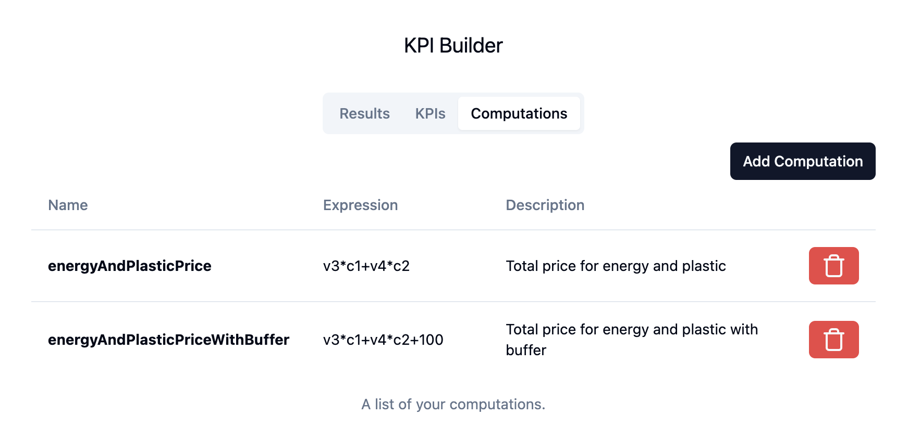
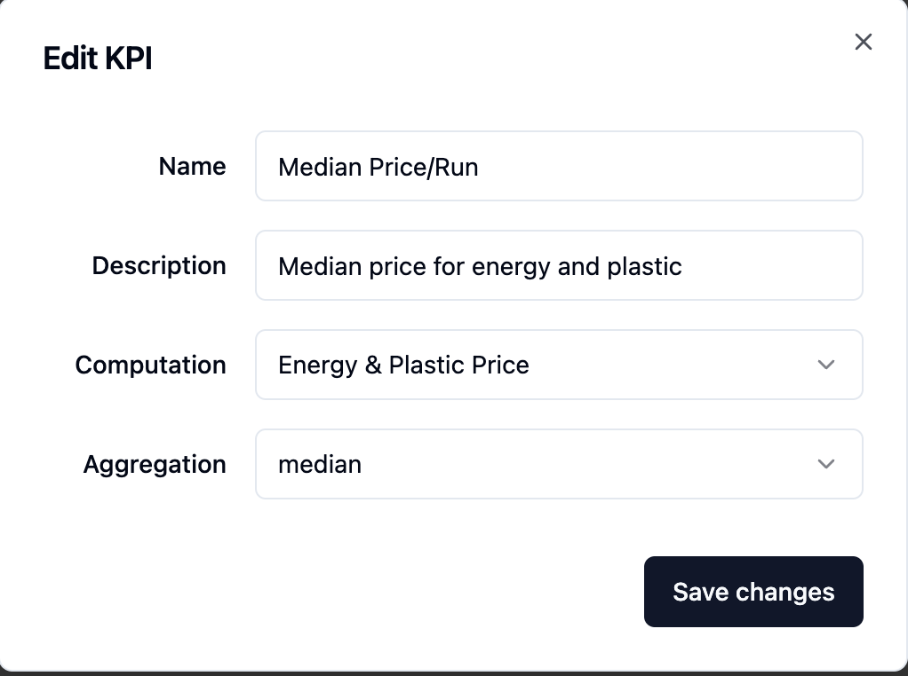
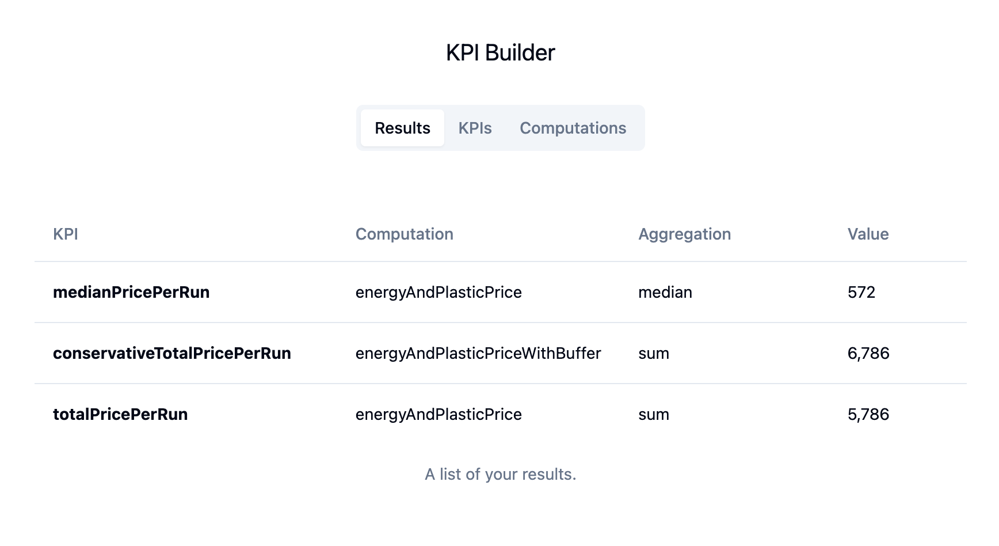

# KPI Builder

PoC of an KPI Builder. You can create computatuons, define KPIs, run them on your timeseries and see the results.

## Add Computations



## Define KPIs



## See Results



# Getting started

## Client

```sh
cd ./kpi-builder-client
npm install
npm run dev
open http://localhost:5173/
```

## Server

```sh
cd ./kpi-builder-server
deno task dev
```

# Next Steps

- [ ] Better UI Feedback and i18n
- [ ] Hardening: add schema and FE validation
- [ ] Testing: add FE & BE tests
- [ ] Make everything editable
- [ ] Support data streams
- [ ] Better state management and caching
- [ ] Dark theme support
